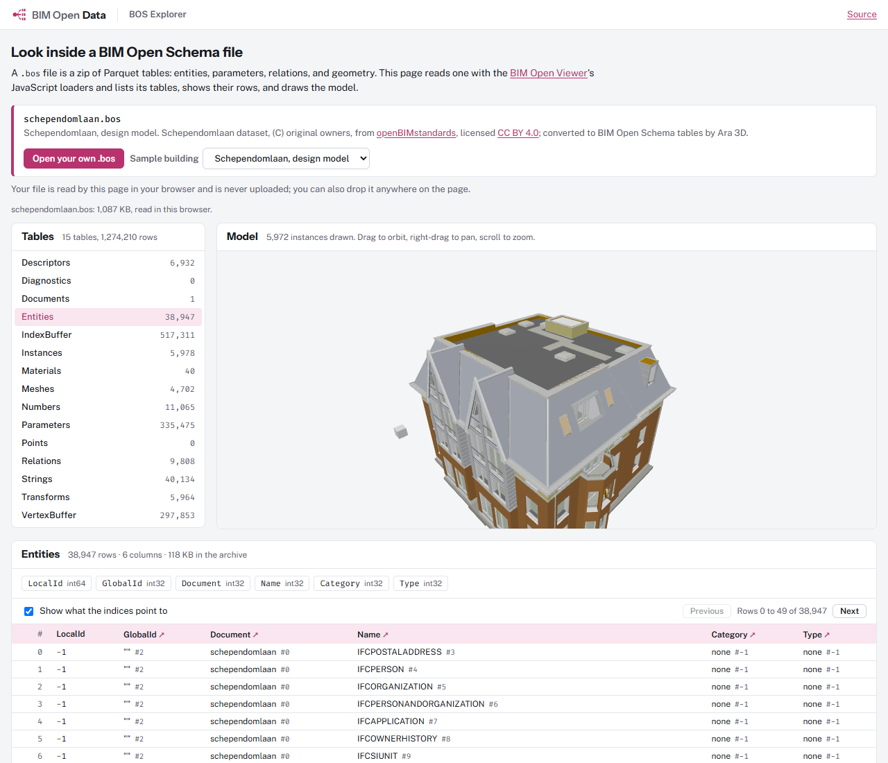

# BIM Open Data


[`bim-open-schema`](https://github.com/ara3d/bim-open-schema) is the specification of BIM Open Schema; this repository is its .NET implementation: reading and writing BOS files, IFC loading, meshing, byte-exact property-set editing, conversion from IFC to BOS and to DuckDB, the IFC MCP server, and the BOS Browser.

**Try it in the browser:** the [BOS explorer](https://ara3d.github.io/bim-open-data/explorer/) opens one of four openly licensed sample buildings, lists its tables with row counts and columns, shows their rows, and draws the model in 3D. It also opens a `.bos` file of your own, read on your device and never uploaded.

[](https://ara3d.github.io/bim-open-data/explorer/)

**Sample buildings:** [`samples/public/`](samples/public/README.md) holds Schependomlaan (CC BY 4.0), DigitalHub architecture, heating, and a four-model federation (MIT), and the Duplex Apartment (CC BY 4.0), each as a `.bos` and a `.duckdb` file with measured counts. Their licences and required attribution are in [`samples/public/NOTICE.md`](samples/public/NOTICE.md).

**Status on 2026-10-03: the code is here.** It moved from [`ara3d/bim-open-toolkit`](https://github.com/ara3d/bim-open-toolkit), with its git history, in phase 4 of the toolkit's [repository split plan](https://github.com/ara3d/bim-open-toolkit/blob/main/docs/plans/repository-split.md). The paths are the ones it had there (`src/data`, `tests/data`, `src/mcp/BimOpenMcp.Ifc`, `tests/mcp/BimOpenMcp.Ifc.Tests`, `apps/`, `tools/`), so `git log --follow` reaches back through the toolkit's history. The toolkit now takes this repository through its own `deps.json`, as `deps/bim-open-data`.

## Build and test

```powershell
node deps.mjs                     # clone bim-open-schema, ara3d-sdk, and parakeet into deps/
dotnet build BimOpenData.sln -c Release
dotnet test BimOpenData.sln -c Release --no-build --filter "TestCategory!=RequiresTestData"
```

Tests tagged `RequiresTestData` read the IFC Test Kit and sample models from `data/`, which is never committed; `data/get-test-data.ps1` copies them from sibling checkouts (see `data/README.md`). The meshing comparison's corpus tests skip themselves when their models are absent. `samples/nrc/` holds the three Duplex files the IFC MCP server's tests read. `samples/public/` holds the converted sample buildings; `node samples/public/fetch.mjs` and `node samples/public/convert.mjs` regenerate them, and `PublicSampleTests` checks their counts.

## What BIM Open Schema is

BIM Open Schema (BOS) stores a building model as plain tables instead of an object graph behind a vendor's API. Entities, parameters, relations, and geometry are each a list; each list is one Parquet file, and a `.bos` file is those Parquet files in a zip. Parameters are stored entity-attribute-value, one table per primitive type, so two parameters can share a name and differ in type. Relations use a closed vocabulary (`PartOf`, `ContainedIn`, `HostedBy`, `BoundedBy`) that covers both the Revit API and IFC (Industry Foundation Classes, the open exchange format for building models).

The tables load straight into DuckDB, an in-process analytical database, which is where most questions get answered.

## What it does not do

- It does not author geometry. IFC editing is limited to property sets.
- It has no live connection to Revit or any other authoring tool. Models arrive as IFC files or as BOS files from the Revit 2025 exporter, which stays in the toolkit's `plugins/`.
- It knows nothing about graphs or node packs. [BIM Open Flow](https://github.com/ara3d/bim-open-flow) builds on it, never the other way round.

## Projects

These are the 21 projects in `src/data`, grouped by what they do. Most target `net8.0-windows` because the IFC loader does; the schema libraries target plain `net8.0`.

### BIM Open Schema

| Project | Role |
|---|---|
| `Ara3D.BimOpenSchema.ObjectModel` | Builders, accessors, and a navigable object graph over the specification's types |
| `Ara3D.BimOpenSchema.IO` | Reading and writing `.bos` archives (Parquet in a zip); Parquet.Net is its only external dependency |
| `Ara3D.BimOpenSchema.IO.Export` | Excel, CSV, Markdown, HTML, and SQLite exports of a table |
| `Ara3D.BimOpenSchema.IO.Bfast` | BFAST serialization of BOS data |
| `Ara3D.BimOpenSchema.DuckDb` | Loading BOS into DuckDB, views, queries, and table helpers |
| `Ara3D.BimOpenSchema.Harmonizer` | Canonical names and SI units across models from different tools |
| `Ara3D.BimOpenSchema.Federation` | Unions several BOS documents into one geometry-free BOS and a DuckDB database |
| `Ara3D.BimOpenSchema.DataModel`, `.DataModel.IO` | A relational snapshot model with validation and a spatial index |
| `Ara3D.BimOpenSchema.BuildingModel`, `.Source`, `.Workflows`, `.Workflows.IO`, `.DuckDb` | A typed building model with source mapping and a DuckDB projection |

### IFC

| Project | Role |
|---|---|
| `Ara3D.IfcTypes` | Generated IFC entity types, produced by `Ara3D.IfcTypeGen` from a Parakeet grammar |
| `Ara3D.IfcLoader` | STEP parsing, with geometry from web-ifc |
| `Ara3D.Ifc.Mesher` | Tessellation in pure C# |
| `Ara3D.Ifc.Editing` | Property-set patching that locates each entity by byte range, so every byte you did not edit comes out identical |
| `Ara3D.Ifc.Bos` | IFC to BOS conversion |
| `Ara3D.Ifc.DuckDb` | One call from an IFC file to a queryable DuckDB database: convert to BOS, load the tables, create the text views |
| `Ara3D.Ids` | Evaluates buildingSMART IDS 1.0 specifications over BOS tables in DuckDB, as a verdict table |

### Applications and servers

| Project | Role |
|---|---|
| `BimOpenMcp.Ifc` | An MCP (Model Context Protocol) server with 29 tools for an AI agent: entities, property sets, quantities, spatial structure, SQL over DuckDB, geometry bounds and volumes, GLB export, and IFC to BOS. Runs over stdio, or HTTP with `--http <port>`. |
| `Ara3D.BimOpenSchema.Browser` | A WPF data-grid viewer for `.bos` files with glTF and Excel export (`net10.0-windows`) |
| `Ara3D.IfcTypeGen` | The generator behind `Ara3D.IfcTypes` |

Eleven test projects in `tests/data` and one in `tests/mcp` cover them; `tests/BimOpenData.TestSupport` holds the shared paths and the mini IFC fixture.

## Dependencies

This repository lists its dependencies in `deps.json` and reads them from the git-ignored `deps/` folder that `node deps.mjs` fills:

- [`bim-open-schema`](https://github.com/ara3d/bim-open-schema), the specification;
- [`ara3d-sdk`](https://github.com/ara3d/ara3d-sdk), general .NET utilities and the MCP protocol helpers;
- [`parakeet`](https://github.com/ara3d/parakeet), the parser library the IFC type generator uses.

`deps.mjs` is the same script in every BIM Open repository. When this repository is itself a dependency (in the toolkit, `deps/bim-open-data`), its own dependencies resolve to siblings in the host's `deps/` folder, so each repository is checked out once. `Directory.Build.props` states the same rule as the MSBuild property `DepsRoot`, and every reference into a dependency goes through it, so the host and this repository reach a shared project by one path and MSBuild builds it once. `Directory.Build.targets` turns each `Ara3D.*` package reference into a project reference into `deps/ara3d-sdk`, so the SDK builds from source at the pinned commit.

Outside packages include Parquet.Net, DuckDB.NET, ClosedXML for Excel, and Xbim.InformationSpecifications for IDS; the IFC loader carries the native web-ifc library.

## Prerequisites

Node.js (for `deps.mjs`) and git, the .NET 8 SDK, and the .NET 10 SDK for the BOS Browser. The IFC stack and the Browser target Windows, so the full repository builds on Windows only.

## Web page

`site/index.html` is the repository's page, deployed to `https://ara3d.github.io/bim-open-data/` by `.github/workflows/pages.yml` on each push to `main` that changes `site/`, `site-src/`, or `deps.json`. The owner must first switch Pages on in this repository's settings (Settings, Pages, Source: GitHub Actions); until then the workflow's deploy step fails.

The BOS explorer at `explorer/` is a small Vite project in `site-src/` that builds into `site/explorer/` (git-ignored; the workflow builds it). The .NET code cannot run in a browser, so the explorer reads archives with the BIM Open Viewer's JavaScript packages instead: `@bim-open-viewer/loaders` for the geometry, `@bim-open-viewer/core` to draw it, and `@bim-open-viewer/controls` to orbit, taken as TypeScript source from `deps/bim-open-viewer` at the commit `deps.json` pins. The table list and rows come from the same Parquet reader those packages use (hyparquet). The "Show what the indices point to" option resolves string-table, entity, document, and descriptor indices and enum codes, following the record types in the specification's `BimOpenSchema.cs`.

The bundled samples are four files from [`samples/public/`](samples/public/README.md), listed in `site-src/sample.mjs`: `schependomlaan.bos` (1.1 MB, opened first), `digitalhub-arc.bos` (0.4 MB), `digitalhub-hzg.bos` (1.0 MB), and `duplex.bos` (0.1 MB). The build copies them from there. The page shows the credit for the building on screen and links to `samples/public/NOTICE.md`; the Autodesk-derived `bim-open-schema/examples` models are no longer bundled, since their redistribution terms are unsettled ([bim-open-toolkit TKT-144](https://github.com/ara3d/bim-open-toolkit/blob/main/tickets/TKT-144-sample-model-redistribution.md)).

```powershell
node deps.mjs                     # adds bim-open-viewer (and its gratify pin) to deps/
cd site-src
npm ci
npm run build                     # type-checks, then writes ../site/explorer/
npm run dev                       # or serve it at http://127.0.0.1:5280/
$env:PLAYWRIGHT_CORE = "<path to an installed playwright-core>"
npm run smoke                     # headless Edge over the built site/; see scripts/smoke.mjs
```

The smoke check serves `site/` under `/bim-open-data/`, as Pages does, and fails on any console error or failed request. It opens Schependomlaan, checks its tables and the Entities row count that `samples/public/samples.json` records (38,947), shows parameter values as text, pages through rows, and waits for the model to draw (5,972 instances). It then picks each other bundled sample (DigitalHub architecture 3,681 instances, heating 4,119, Duplex 660) and checks its Entities count, its drawing, and its credit, and finally opens the geometry-free `digitalhub-federated.bos` through the file input. `--screenshot docs/images/explorer.png` refreshes the picture above.

The explorer loads archives with `bosToGroups(..., { sourceUp: 'Z' })`: BOS models are z-up and the viewer is y-up, and since viewer `b0ec646` the loader also treats a missing `InstanceFlags` column (older archives) as nothing hidden. It reads both the current single `Parameters` table, whose `Value` it resolves through the row's descriptor type, and the older per-type parameter tables.

## The family

BIM Open Data is one of the BIM Open repositories, alongside [BIM Open Flow](https://github.com/ara3d/bim-open-flow) (graphs over the tables), [BIM Open Viewer](https://github.com/ara3d/bim-open-viewer) (the 3D viewer), [BIM Open Notebook](https://github.com/ara3d/bim-open-notebook) (agent sessions as documents), and [BIM Open Toolkit](https://github.com/ara3d/bim-open-toolkit), which joins them. The mark and colours follow the toolkit's `docs/BRANDING.md`.

## License

MIT. See `LICENSE`. The sample buildings in `samples/public/` and `samples/nrc/` keep their own licences (CC BY 4.0 and MIT); see `samples/public/NOTICE.md`.
